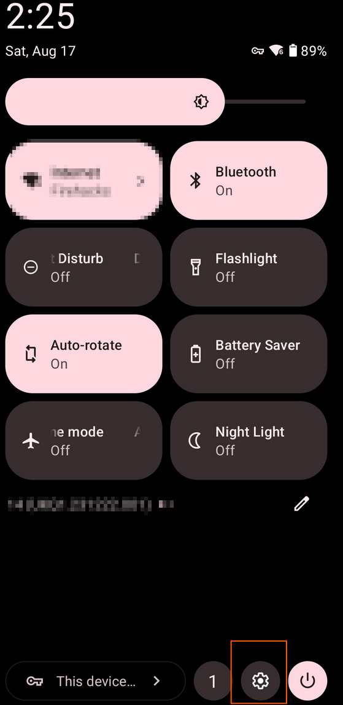

# AR-hacking-platform
A guide for turning the XReal AR eco system into a CTF/Pentesting/Hacking platform.

NOTE THIS IS A WORK IN PROGRESS I'LL ADD IMAGES WHERE THE IMAGE PLACE HOLDERS ARE EVENTUALLY.

#IMPORTANT
Some of this guide will describe rooting the Xreal BeamPro.  Rooting any android device carries an extremely small risk of bricking the device and rendering it unbootable. I am not responsible for any bricked devices while attempting to follow this guide, nore am I responsible with what you do after setting up this environment.  This is meant for ethical hacking, be it CTFing, Penetration Testing, or Security Research.  I am not responsible for any actions taken by anyone who followed this guide.

With all that out of the way I want to say that 90% of the functionality of this setup can be achieved without rooting the device. The only thing that really matters that root access provices is the ability to natively edit your hosts.txt file, and the ability to listen on port numbers lower than 1024.  Everything else, including the microsocks setup that will be described can be done without rooting the Xreal BeamPro.  Gaining Root is more just to "own" the device I bought and paid for. I firmly believe that it should be illegal for companies to make it impossible to gain full administrative access to devices that you the user bought and paid for, but that's besides the point.  Let's get into it.

# Environment Setup
NOTE IF YOU PLAN TO ROOT YOUR BEAMPRO PELASE FOLLOW THE ROOTING SECITON FIRST ROOTING THE DEVICE WILL WIPE ALL USER DATA AND YOU"LL HAVE TO COMPLETELY RE-DO THIS SECTION IF YOU CHOOSE TO DO IT FIRST. 
EVERYTHING IN THIS SECTION CAN BE DONE WITHOUT ROOT BESIDES THE THINGS THAT ARE NOTED DIFFERENTLY.

Note while its possible to do MOST things on android that you would normally do on other linux distributions its important to note that some things are just easier and better to do on full fat x86 linux installs. As such I would highly recommend having a desktop/server you can remote into for such times. I use Tailscale as a mesh VPN network and a combination of SSH, Microsocks, and Sunshine/Moonlight to get my "Desktop away from home" experience when hacking/ctfing/pentesting.  Part of this setup will be covered in this seciton, mainly the parts involving microsocks and portforwarding, but I'll mainly focus on getting up and running with a usable environemnt on android.

For starters you'll want to install the Fdroid App store (https://f-droid.org/) on the BeamPro. The primary app we'll be using to get things setup is Termux, and the best place to get that is on fdroid. Install Termux (and optionally termux:boot, and termuc:API if you want to run things at boot and using the android API).

Once you have Termux installed be sure to open it and run the commend `termux-change-repo` and select "Mirror groRotate BetweeN...."

IMAGE

Select the region closest to yourself using the arrow keys, then hit enter.

IMAGE

once that is finsihed run `pkg updtae && pkg upgrade`

let the update finish then set up your terminal how you like it.  Personally I installed fish and used chsh to set it as my shell.

If you rooted your BeamPro you can install the termux-root package to get root capabilities like chrooting into other environments to get more linux packages and things.  I personally haven't played a ton with that yet, but do look forward to trying it out!

There are several tools you can install on Termux, though they were catching some flack for being "for hacking" or "enabling hacking" which they were not comfortable with (for some reason) and removed alot of the really useful tools from their repositories.  That being said, nmap, ncat, socat, and dirb can all be installed just using pkg install.  

Now if you want to connect to your computer back at home and proxy tools through your BeamPro you'll need to pkg install microsocks which is a really cool project that's a socks5 server in a binary.  No config file needed. https://github.com/rofl0r/microsocks

If you want to forward prots through back to your desktop at home you'll need socat to do that, and if those ports are lower than port 1024 you'll need to root your Beampro.

You can install metasploit, but its not in the official repos, here's a github for a quick and dirty install https://github.com/gushmazuko/metasploit_in_termux

# Rooting the Xreal BeamPro
As stated above this carries the small risk of bricking the device, follow at your own peril. Most of the functionality described later can be achieved without this step.

Starting off I followed this post on the Xreal sub reddit and what to give the OP and everyone who helped OP out rooting it for the first time all the credit here. So for a more detailed guide please read this reddit post.
https://www.reddit.com/r/Xreal/comments/1efvvek/guide_how_to_root_xreal_beam_pro/ (I do have a copy saved locally incase it ever becomes unavailable, never know with the bone head in charge of reddit right now, so if this ie ever not accessible in the future please open an issue and I'll repost here.)

The TLDR: is
install adb and fastboot on your PC, if you have linux the best way is probably just through your package manager. If your on Windows, first of all I'm sorry, I hope you can get out of that abusive relationship at some point in the future. Second of all, check out the guide at the reddit link above.  I don't use Windows so I can't help you there.  If you're on Mac....  uhhh .... well.... Asahi is a thing.... moving on.

## Unlocking the Boot Loader
NOTE THIS WILL WIPE ALL USER DATA, BACK UP ANYTHING YOU WANT TO KEEP
Now that you have the tools on your PC that you need you'll want to go into your Xreal BeamPRo and open the settings app.  The easiest way to do that is to swipe down on the notification area, then swipe down again for the quick access toggles menu, in the lower right hand corner.

Once you open the settings scroll all the way down to "About This Device"
IMAGE

Then scroll down to Build Number.
IMAGE

Tab build number until it says you're a developer then tap the back arrow and tap on "System" in the main settings menu.
IMAGE

Tap on developer options
IMAGE

In the Developer options enable OEM Unlocking and USB Debugging
IMAGE
IMAGE

Then plug the GLASSES port of the BeamPro into your computer and run `adb devices` this will prompt you to accept the connection on the BeamPro.  Accept it and then ADB should list a device.
IMAGE

run `adb reboot bootloader` to enter the bootloader of the BeamPro.
IMAGE

After the device is booted into the bootloader run `fastboot flashing unlock` there may be some error or warning messages, this is fine.
Reboot the BeamPro and go through the first time setup again, afterwards follow the instructions above to re-enable usb debugging and oem unlocking again.

## Finally Actually Rooting the Device
There are many methods to root an android device.  I personally prefer Magisk because you can have it prompt for authentication before granting any application root access, effectively making it like a sudo analog.
Install the Magisk APK on the BeamPro from https://github.com/topjohnwu/Magisk. There are fake ones out there, so be sure to get it directly from the github releases page. In order to root the device we need a magisk patched boot.img.  Since Xreal does not pbulicly provide the firmware files for the BeamPro we have 3 options for obtaining it. 

The first is to wait for an OTA update and set up a Machine in The Middle (MiTM) attack to sniff and dump the firmware out of the air. This is possible... but beyond the sope of this guide, and frankly the other two methods are easier.

The Second is if you're build number happens to match the build number in the Reddit Guide you can just download the .img file from the linked google drive. (GO TO THE REDDIT PAGE MENTIONED ABOVE) and just use that!

The Third Option is to create your own img file using an Android GSI (Generic System Image) that has the same kernel version as your BeamPro (the reddit post has a direct donwload link to one such image).
Download that zip and extract it After extraction you'll have an .img file.
IMAGE

upload that file to your BeamPro using what ever method you like. then open the magisk app we installed before. In magisk tap in install.
IMAGE

select the option for "Select and Patch a File"
IMAGE

navigate to the image file you downloaded and magisk will patch that file to be be rooted.  Once the file is patched copy it back over to your computer and name it something that you'll recognize like magisk.img.
Back on your computer, make sure the BeamPro is plugged in via the GLASSES port, then open a terminal and cd into the same directory as that magisk.img file you just copied over (or the image you downloaded from the reddit post if you had the right build number) and run `adb reboot bootloader` again. 

Once the boot loader is booted on the BeamPro run the command `fastboot boot magisk.img` or replace magisk.img with the name of the file you downlaoded.
IMAGE

Once your BeamPro is booted open the magisk app again.  You may get a message about additional steps being required, ignore and cancel that. Tap on install again, but this time select "Direct Install". 
IMAGE

One this proccess finishes reboot the device again, and once again open the magisk app.  This time if the additional step required dialog pops up tap on accept and continue.  If that dialog does not pop up insure the Magisk app says "INSTALLED" on the main screen.
IMAGE

IMPORTANT: DO NOT UPDATE YOUR BEAMPRO NORMALLY, THIS WILL UNROOT IT. INSTEAD FOLLOW THE BELOW INSTRUCTIONS WHEN AN UPDATE IS AVAILABLE.

## updating your BeamPro while preserving Root access
Open the Magisk app and select uninstall
IMAGE

Then select RESTORE IMAGES
IMAGE

Download and install the update as normal, but DO NOT REBOOT YET.

Re open the Magisk app and tap on install then select INSTALL TO INACTIVE SLOT (AFTER OTA)
IMAGE

then reboot the device and you're done.

## Helpful Tip
By default Magisk behaves more like Windows UAC then sudo on Linux. Meaning for an app to be granted root access it will just prompt you to accept it, without entering any authentication information.  If this is what you want then ignore this part, if you're like me and paranoid and think that's the dumbest way to grant admin access to a device I own (thanks microsoft) then open the magisk app and tap on the settings gear in the upper right corner

IMAGE

scroll down to the Superuser section and enable the "User Authentication" option
IMAGE

Now you're done!
